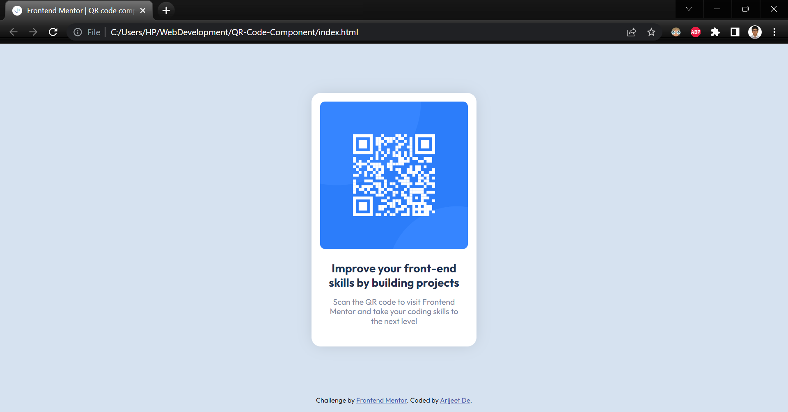

# Frontend Mentor - QR code component solution

This is a solution to the [QR code component challenge on Frontend Mentor](https://www.frontendmentor.io/challenges/qr-code-component-iux_sIO_H). Frontend Mentor challenges help you improve your coding skills by building realistic projects. 

## Table of contents

- [Overview](#overview)
  - [Screenshot](#screenshot)
  - [Links](#links)
- [My process](#my-process)
  - [Built with](#built-with)
  - [Continued development](#continued-development)
  - [Useful resources](#useful-resources)
- [Author](#author)

## Overview

### Screenshot

### Links

- Solution URL: [Click Here](https://your-solution-url.com)
- Live Site URL: [Click Here](https://your-live-site-url.com)

## My process

### Built with

- Semantic HTML5 markup
- CSS custom properties

### Continued development

I want to focus on Flexbox and CSS Grid.

### Useful resources

- [Box-Shadow-Generator](https://cssgenerator.org/box-shadow-css-generator.html) - This helped me on generating Box Shadows.

## Author

- Name: Arijeet De
- GitHub - [@debroglie27](https://github.com/debroglie27)
- Frontend Mentor - [@debroglie27](https://www.frontendmentor.io/profile/debroglie27)
- Facebook - [@arijeet.de](https://www.facebook.com/arijeet.de)
- Instagram - [@121debroglie](https://www.instagram.com/121debroglie/)